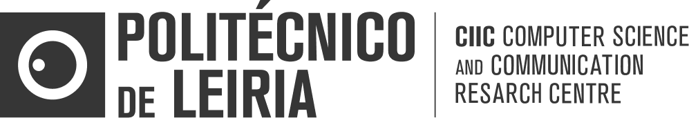

## Computer Science and Communication Research Centre (CIIC) - Communications & Telematics (C&T) Group Repository

Welcome to the **Communications & Telematics (C&T)** Group repository, part of the Computer Science and Communication Research Centre (CIIC) at the Polytechnic University of Leiria! CIIC is a dedicated research center specializing in advancing knowledge and innovation across four key areas:

- Computational Intelligence and Optimization
- **_Communications and Telematics (C&T)_**
- Computer Graphics and Multimedia Research
- Smart IoT Ecosystems

### Objectives

Our mission is to foster collaboration, provide resources, and advance research in Communications and Telematics. Specifically, we aim to:

- **Facilitate Collaboration**: Connect, share, and collaborate on CIIC projects to achieve collective progress.
- **Build a Resource Hub**: Assemble and maintain resources that benefit current and future research endeavors. 

### Getting Involved

Interested in joining or contributing to our projects? We welcome researchers, collaborators, and innovators to help us push the boundaries of our research.

For more information, visit our <a href="https://ciic.ipleiria.pt/" target="_blank">CIIC website</a>.

---

    

---
